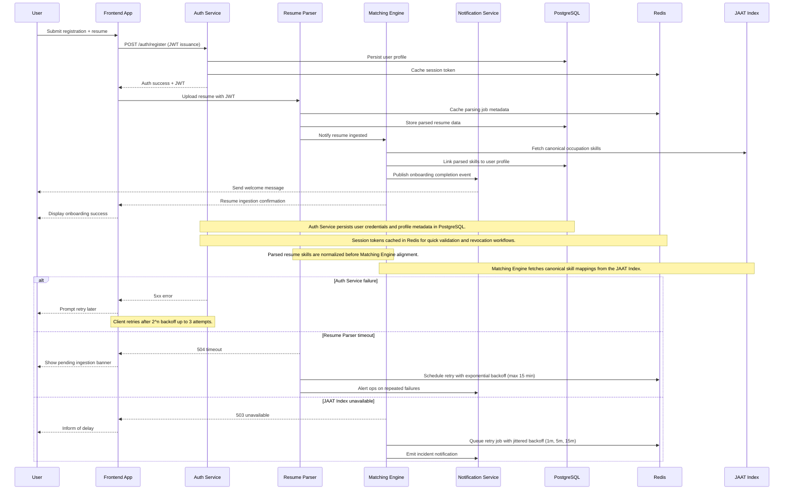
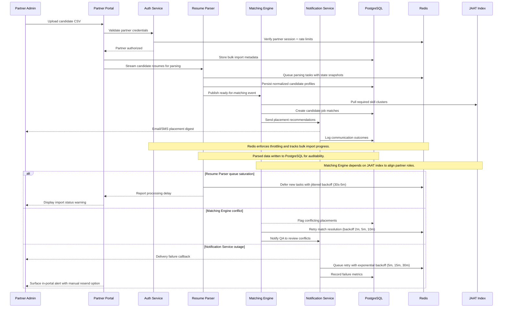

# SkillForge Sequence Flows

## Onboarding to Resume Ingestion


## Assessment Scoring to Recommendation Generation
```mermaid
sequenceDiagram
    participant U as User
    participant FE as Frontend App
    participant AUTH as Auth Service
    participant ME as Matching Engine
    participant RP as Resume Parser
    participant PG as PostgreSQL
    participant RD as Redis
    participant JI as JAAT Index
    participant NS as Notification Service

    U->>FE: Submit assessment responses
    FE->>AUTH: Validate session (JWT introspection)
    AUTH->>RD: Retrieve session context
    AUTH-->>FE: Session valid
    FE->>PG: POST assessment responses (REST)
    PG-->>ME: Trigger scoring event
    ME->>PG: Fetch user history + parsed resume
    ME->>JI: Retrieve occupation competency vectors
    ME->>RD: Cache intermediate scoring artifacts
    ME-->>PG: Persist assessment scores & recommendations
    PG-->>NS: Emit recommendation-ready event
    NS-->>U: Send notification (email/push)
    FE<-NS: Webhook to refresh UI
    FE-->>U: Display personalized recommendations

    Note over PG,ME: Matching Engine aligns assessment outputs with JAAT taxonomy stored in the JAAT Index.
    Note over ME,RD: Redis caches scoring states to resume processing on retries.
    Note over NS,U: Notification Service keeps users updated on recommendation readiness.

    alt Session validation fails
        AUTH-->>FE: 401 Unauthorized
        FE-->>U: Prompt reauthentication
        Note over FE,AUTH: Immediate retry blocked until user refreshes credentials.
    else Matching Engine error
        ME-->>PG: Error event logged
        ME->>RD: Requeue scoring job with exponential backoff (1m, 2m, 4m)
        ME->>NS: Notify DevOps on repeated failures
        NS-->>U: Inform delay in recommendations
    else JAAT Index lag
        ME-->>PG: Partial results stored
        ME->>RD: Schedule refresh to hydrate gaps
        PG-->>FE: Return partial recommendations flag
        FE-->>U: Display partial recommendations banner
    end
```

## Partner Bulk Import to Placement

