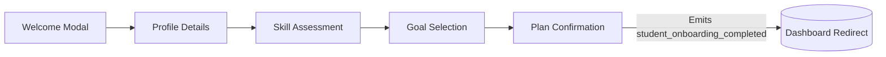
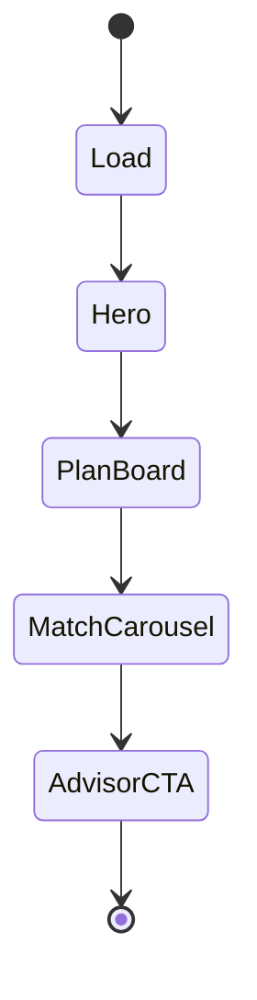
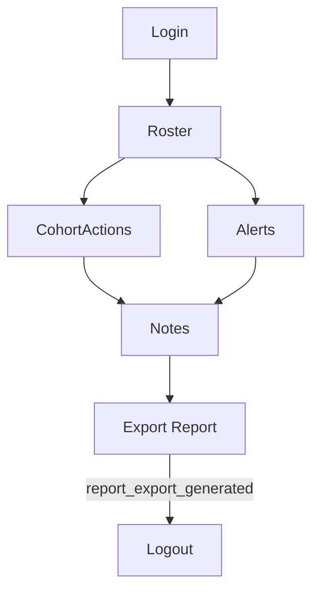
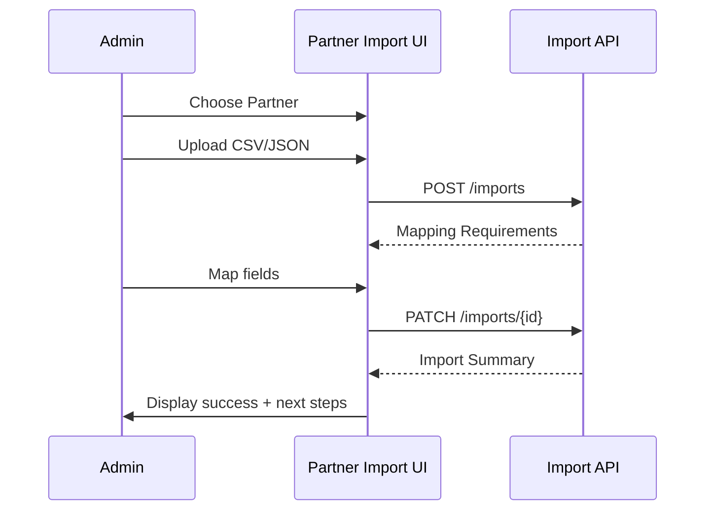

# SkillForge Persona Workflow Mocks

These Figma-ready mock specifications translate the documented persona journeys into screen blueprints. Each section provides a linkable frame description, structured layout notes, and component annotations so the design team can reproduce or refine the visuals in Figma (or any equivalent design tool).

> **How to use:** Create a Figma file named `SkillForge Persona Flows`. Add four pages matching the sections below, and copy the frame specifications verbatim. Tokens reference the design system described in `docs/ARCHITECTURE.md` and the analytics events in `docs/ANALYTICS.md`.

---

## 1. Onboarding Wizard (Student & Career Changer)

**Frame name:** `Onboarding / Wizard`

**Viewport:** Desktop 1440 × 900

**Layout grid:** 12 columns, 72 px margins, 16 px gutters

**Primary components:**
- `Header.AppBar` with brand lockup, progress tracker (steps 1–4), accessibility skip link
- `Stepper.Horizontal` showing four milestones (`Create Profile`, `Assess Skills`, `Select Goals`, `Confirm Plan`)
- `Card.Surface` using MUI `Paper` with Tailwind classes `bg-white shadow-lg rounded-2xl`
- `Form.Fieldset` blocks for persona intake, skills checklist, and readiness self-rating
- `CTA.Primary` button labeled `Continue`, secondary `Save & Exit`

**Interaction flow:**

**Analytics hooks:**
- Step change triggers `onboarding_step_viewed`
- Final CTA triggers `student_onboarding_completed`
- Opt-out toggle surfaces `settings_tracking_opt_out`

**Accessibility annotations:**
- Each step container labelled via `aria-labelledby` for screen readers
- Live region announcing step progress changes
- Keyboard focus trap within modal context

---

## 2. Student Dashboard (Action Plan Focus)

**Frame name:** `Dashboard / Student`

**Viewport:** Desktop 1440 × 1024

**Layout grid:** 12 columns, 80 px margins, 24 px gutters

**Primary zones:**
1. **Hero Progress Banner:** `Card.Highlight` with readiness score donut chart, `aria-describedby` linking to readiness delta explanation.
2. **Action Plan Board:** Kanban-style swimlanes (`Upcoming`, `In Progress`, `Completed`) using Tailwind utility spacing on top of MUI `Grid`.
3. **Assessment Reminders:** Notification list with `ListItem` components and inline action buttons.
4. **Career Matches:** Carousel referencing `career_match_viewed` event on slide change.

**Interaction flow:**

**Analytics hooks:**
- Loading dashboard emits `session_started`
- Clicking task checkboxes emits `task_completion_logged`
- Viewing match detail card emits `career_match_viewed`

**Accessibility annotations:**
- Provide keyboard-accessible drag handles for Kanban; fallback buttons for reordering
- Charts include text equivalents with `aria-live="polite"`
- Color contrast ratio minimum 4.5:1 across hero banner

---

## 3. Advisor Portal (Cohort Intelligence)

**Frame name:** `Portal / Advisor`

**Viewport:** Desktop 1600 × 1024

**Layout grid:** 16 columns, 64 px margins, 16 px gutters

**Primary modules:**
- **Roster Overview:** Data grid with sortable columns (`Advisee`, `Readiness`, `Last Login`, `Interventions`). Include filter chips for persona segmentation.
- **Alerts Drawer:** Right-side flyout summarizing `readiness_alert_triggered` items with severity badges.
- **Cohort Actions:** Bulk action toolbar (assign assessment, send nudges) tied to `cohort_assessment_assigned` event.
- **Notes Workspace:** Split-pane editor referencing `advisor_note_added` with autosave indicator.

**Interaction flow:**

**Accessibility annotations:**
- Data grid supports column header keyboard navigation (`role="columnheader"`)
- Alerts Drawer announced via `aria-live="assertive"`
- Provide high-contrast focus outlines around selection checkboxes

---

## 4. Partner Import (Data Operations)

**Frame name:** `Integrations / Partner Import`

**Viewport:** Desktop 1280 × 900

**Layout grid:** 8 columns, 56 px margins, 24 px gutters

**Primary steps:**
1. **Partner Selection:** Dropdown with partner metadata preview and SLA badge.
2. **File Upload:** Drag-and-drop zone with status bar; success triggers `partner_import_uploaded` (new event aligning with analytics conventions).
3. **Schema Mapping:** Dual-column table aligning partner fields with SkillForge schema; inline validation with error badges.
4. **Import Summary:** Confirmation panel with readiness checks and next steps CTA.

**Interaction flow:**

**Accessibility annotations:**
- File upload zone exposes accessible button with `aria-label`
- Table cells support keyboard navigation and inline edit announcements
- Error messaging follows WCAG 2.2 timed response guidance

---

## Deliverable Checklist
- [x] Frame names, viewport sizes, and grids documented
- [x] Interaction flows provided via Mermaid diagrams
- [x] Analytics instrumentation points aligned with `docs/ANALYTICS.md`
- [x] Accessibility annotations aligned with `docs/ARCHITECTURE.md`

These specifications can be copied into Figma by creating frames with the same structure, ensuring alignment with the engineering implementation path.
